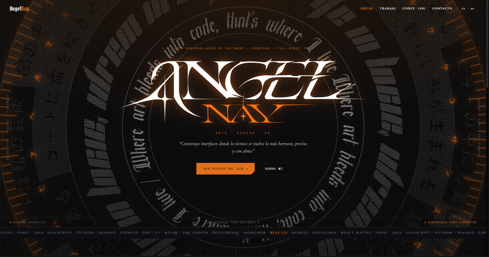

<div align="center">


# ANGEL NAY — Portafolio 2026

**Arte · Código · Yo**

Mi portafolio personal y mi espacio para mostrar todo lo que construyo:
desarrollo web, diseño, ilustración y experimentos.

[Ver sitio en vivo](https://angelnay.vercel.app) · [Behance](https://www.behance.net/NayNiNay)


</div>

---

## ¿Qué es esto?

Este repositorio es **mi portafolio completo**, y la idea es que crezca conmigo.
No es solo una página de presentación: es el lugar donde voy a subir cada proyecto nuevo,
cada pieza de arte y cada experimento que haga, con una estética propia **darktech**
(gótico + cyber) que nació de mis pósters.

## Secciones

| Sección | Qué muestra | Estado |
|---|---|---|
| **Home** | Presentación, perfil y proyectos principales | ✅ Listo |
| **Works** | Hero de destacados, proyectos y vista completa con filtros | 🚧 En construcción |
| **Art** | Ilustración, pósters y diseño | 📝 Planeado |
| **Codex** | Notas, aprendizajes y bitácora de desarrollo | 📝 Planeado |
| **Contact** | Cómo escribirme | 📝 Planeado |

### Works, en detalle

La página de trabajos tiene tres partes:

1. **Hero de destacados:** hasta 5 proyectos con video en bucle, que rotan solos cada 10 segundos. Se ordenan según likes o vistas.
2. **Proyectos:** carrusel con el detalle de cada proyecto, ya sea de desarrollo, diseño u otro tipo.
3. **Todos los proyectos:** vista completa con filtros por tipo y paginación.

## Tecnologías

- **React + Vite** como base
- **React Router** para la navegación entre páginas
- **i18n propio** con soporte para español e inglés
- **CSS separado por sección** (`src/styles/`), con tokens de diseño compartidos

## Estructura

```
src/
├── components/       # Componentes por sección (hero, works, ...)
├── pages/            # Una página por ruta (home, works, ...)
├── data/             # Contenido: proyectos del Home y de Works
├── i18n/             # Textos ES / EN
└── styles/           # tokens.js + CSS de cada sección
```

Cada proyecto de Works es un archivo en `src/data/works/projects/`, con su estructura
y sus textos en español e inglés. Para agregar uno nuevo basta con crear el archivo.

## Correrlo en local

```bash
git clone https://github.com/AngelAyaNAY/portfolio-2026.git
cd portfolio-2026
npm install
npm run dev
```

Luego abre la dirección que muestre la terminal (normalmente `http://localhost:5173`).

## Roadmap

- [x] Estructura base, rutas e i18n ES/EN
- [x] Home con proyectos y filtros
- [x] Hero de Works (cascarón)
- [ ] Conectar el Hero con los datos y el ranking por métricas
- [ ] Sección de proyectos (carrusel + detalle)
- [ ] Vista de todos los proyectos con filtros y paginación
- [ ] Página de detalle por proyecto (`/work/:id`)
- [ ] Videos reales de cada destacado
- [ ] Sección Art
- [ ] Sección Codex
- [ ] Sección Contact
- [ ] Optimización de imágenes y rendimiento
- [ ] Despliegue continuo en Vercel

## Sobre mí

Soy **Miguel Ángel Ayala**, desarrollador full-stack junior con enfoque en frontend,
de Bogotá, Colombia. Me gusta construir interfaces donde lo técnico se vuelve hermoso,
y dibujar cuando no estoy programando.

---

<div align="center">

*Hecho con código, arte y mucha curiosidad.*

</div>